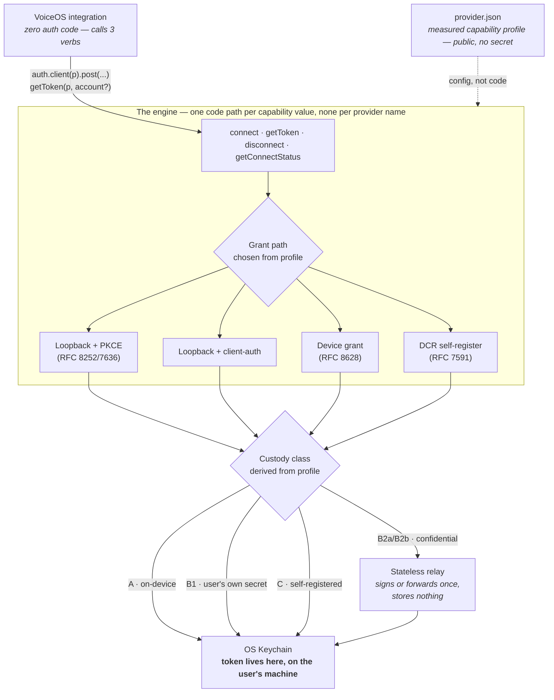

# Universal VoiceOS OAuth (Handshake)

One provider-agnostic OAuth engine that makes `auth: "oauth2"` actually work for any VoiceOS custom integration — real Connect UX, tokens minted straight into the OS keychain, zero auth code per provider. Composio holds every user's tokens for a fixed catalog; this holds nothing, works for any provider you can describe in a config file, and makes the authorization cost of the next integration zero lines of code.

## The problem it solves

VoiceOS has two worlds. The famous connectors get a real **Connect** button, brokered server-side by Composio, with every user's tokens living on a third party's infrastructure. **"Build Anything"** — the actual differentiator — ships an `auth.kind: "oauth2"` slot in the manifest with **nothing behind it**: no callback, no token exchange, no refresh. The only path that works today is pasting a raw API key into a text field where it sits in plaintext on disk. The shipped Stripe example stores a `client_secret` in the clear.

So the promise is "build anything" and the reality is "build anything, as long as it authenticates with a pasted secret." This engine fills the dead slot: a spoken "connect &lt;provider&gt;" opens the provider's own Allow screen, the token lands encrypted in the login Keychain, and it never transits VoiceOS or any third-party server.

Integrations themselves — the per-provider tool code — are a **separate layer built on top of this engine**, and are not part of this repository. This repo is just the engine: the auth broker, the provider-profile contract, the stateless relay, and the tooling that proves them.

## Architecture at a glance

One engine. Per-provider **config**, never per-provider **code** — `if (provider === 'slack')` is a permanent bug, enforced by a test that greps the source. Every way providers differ (PKCE support, client-auth requirement, redirect rules, refresh rotation, token shape, …) is a measured field in a `provider.json`; every field value maps to exactly one code path.



## Quickstart

Node ≥ 22.18 (runs TypeScript natively — the engine has **zero runtime dependencies**). No account, no registration, no secret needed to see it work end to end.

```bash
npm ci         # install the build-time toolchain (TypeScript + vitest); the engine ships zero runtime deps
make demo      # real engine · real HTTP OAuth · built-in mock provider
make verify    # the full gate: build · typecheck · invariants · zero-dep · no-secret-leak · no per-provider branch · full suite
```

`make demo` runs the whole round trip against a built-in mock authorization server and needs **no install at all** — it is pure node: `connect()` opens the flow and returns in ~1 second while consent completes out of band, the token is exchanged and vaulted, `auth.client()` calls a protected resource with a token the calling code never sees, then the access token is expired to prove the silent 401 → refresh → retry → 200 path.

`make verify` type-checks and runs the full suite, so it needs the build-time toolchain. It installs it for you on first run (the `deps` step), which is why it is green from a truly cold clone — the `npm ci` line above just makes that step explicit and is optional if you go through `make`.

## The five custody classes

Custody is derived from the measured profile, not chosen by hand, and shown to the user at connect time. Strongest to weakest:

| Class | One sentence |
|---|---|
| **A — public / PKCE** | `client_auth: none` + `pkce: S256` — fully on-device, no secret anywhere, nothing touches VoiceOS or any server. |
| **B1 — bring-your-own secret** | The user registers their own app with the provider and their `client_secret` lives in their own keychain — nothing distributed, nothing shared. |
| **B2a — relay assertion-signing** | Where the provider supports `private_key_jwt`, a stateless relay signs a request-scoped client assertion and the device does the exchange itself — the relay never sees the code, verifier, or token. |
| **B2b — relay encrypted forwarding** | Where a raw shared secret is unavoidable, the relay performs one exchange and returns the token sealed to the device's ephemeral X25519 key, wiping the plaintext — it sees one token, one moment, one flow, and stores nothing. |
| **C — DCR** | The provider supports RFC 7591 dynamic client registration, so the engine self-registers a client per user and the credentials live on the device. |

The audit sentence: compromising the relay yields the ability to complete future exchanges for the one app whose secret it holds, plus (B2b only) any token in flight at that instant — never a stored token, because the relay stores none. Compromising a broker yields every connected user's live tokens, at rest, indefinitely. Different orders of magnitude, and the difference is architectural.

## Grant paths supported

Four paths, selected from the profile — no provider is unsupported, some just carry more ceremony:

1. **Loopback authorization code with PKCE** (RFC 8252 + RFC 7636) — the preferred path: public client, no secret, fully on-device.
2. **Loopback authorization code with client authentication** — identical up to the token exchange, which needs a secret and therefore a custody decision (B1 / B2).
3. **Device authorization grant** (RFC 8628) — a short user code and a URL, for headless boxes, remote sessions, and providers that refuse loopback redirects.
4. **Dynamic client registration** (RFC 7591) — the engine registers a client on the fly; credentials stay on the device (Custody Class C).

## Add a provider

A new provider costs zero lines of auth code and one `provider.json` config file. See **[docs/ADD-A-PROVIDER.md](docs/ADD-A-PROVIDER.md)** — it walks through a fully worked `provider.json` inline and points at the runnable reference (`tools/mock-provider/` + `make demo`), so you can add any provider from that one file. Register the profile in your own integration with:

```js
import { registerProvider } from './engine/src/index.ts';
registerProvider(profile);   // profile = your parsed provider.json
```

## Layout

- `engine/` — the one engine (built once; the integration layer on top contains zero auth code). `engine/src/config.ts` is the sole source of the redirect URI.
- `relay/` — the stateless relay reference implementation (B2a assertion-signing, B2b encrypted forwarding). No storage, no database, no token retained past one response.
- `provider.schema.json` — the frozen v1 provider-profile contract, machine-readable twin of `engine/src/types.ts`.
- `tools/` — `demo.mjs`, `mock-provider/`, `scan-secrets.mjs`, `drift-check.mjs`, `probe.mjs`, and the rest of the CLI surface.

## Checks

`make verify` needs no prior step — it installs the build-time toolchain itself. The raw `vitest`/`tsc` commands below assume you have run `npm ci` first (otherwise `npx` resolves an unrelated remote `tsc` package):

```bash
make verify                  # the one-command gate — installs the toolchain, then runs all of the below in cheap-fails-first order
npm ci                       # once, before the raw commands below (installs TypeScript + vitest; engine stays zero-runtime-dep)
npx vitest run               # the full test suite (625 tests, zero runtime deps)
npx tsc --noEmit             # strict, node-native TypeScript (no emit step — node strips types)
node tools/scan-secrets.mjs  # the GitHub-push secret gate — matches credential shapes, never prints them
make help                    # list every make target
```

## Docs

- [`docs/handshake/SPEC.md`](docs/handshake/SPEC.md) — the capability model, custody classes, threat model, and positioning, in full.
- [`docs/ADD-A-PROVIDER.md`](docs/ADD-A-PROVIDER.md) — add any provider in ~20 lines.
- [`docs/ARCHITECTURE.md`](docs/ARCHITECTURE.md) — code-level design, the three layers, registration strategy.
- [`docs/THREAT-MODEL.md`](docs/THREAT-MODEL.md) — the attack catalog, each entry mapped to a test.
- [`docs/handshake/ENGINE-GAP-ANALYSIS.md`](docs/handshake/ENGINE-GAP-ANALYSIS.md) — what is built vs. the spec, module by module.

## License

MIT — see [LICENSE](LICENSE).
